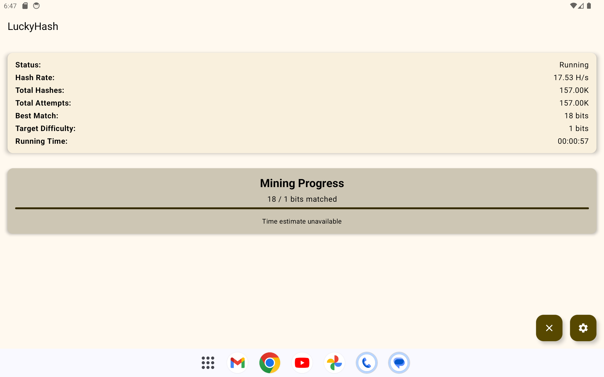
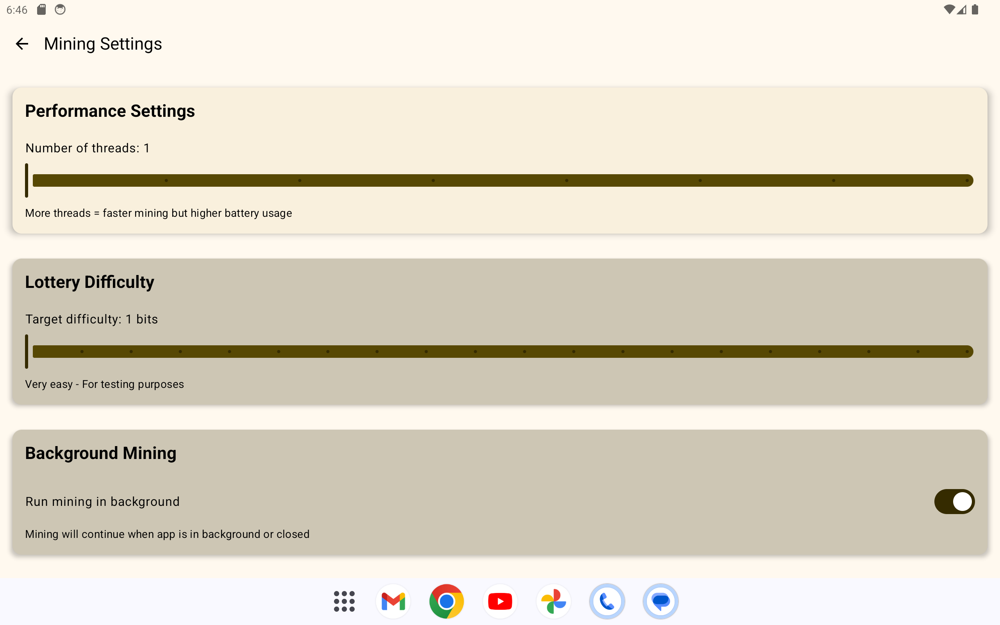

---

# 🎰 LuckyHash

**Mine Bitcoin. Win Big. All while watching your favorite show.**

---

## 🪙 Inspiration

Las Vegas — the city of bright lights, jackpots, and second chances — was the perfect backdrop for **LuckyHash**. We were inspired by the idea of turning idle devices and entertainment time into a shot at winning, combining the thrill of the **lottery** with the steady pulse of **Bitcoin mining**.

> Imagine watching your favorite TV show while your screen quietly mines in the background — and suddenly, you hit a lucky block. That’s LuckyHash.

---

## 💡 What It Does

**LuckyHash** transforms your Android TV or old tablet into a fun, passive Bitcoin miner — with a twist of luck:

- ⛏️ Performs lightweight Bitcoin mining tasks
- 📺 Runs in the background while you stream shows or display useful data
- 📊 Shows real-time stats, hash performance, and lottery probabilities in a beautiful, interactive UI

It’s where crypto meets entertainment.

---

## 🛠️ How We Built It

LuckyHash is built natively for Android with a focus on performance and usability:

- **Kotlin** for clean, modern Android development
- **Jetpack Compose** for a responsive, scalable UI
- **Background workers** to manage mining tasks seamlessly without interrupting media playback

---

## 🚧 Challenges I Ran Into

- ⚙️ Balancing mining intensity and device performance — ensuring mining runs smoothly without overheating or draining the system
- 📱 Designing for Android TV and tablets — adapting UI/UX for large screens and non-touch input

---

## 🏆 Accomplishments I'm Proud Of

- 🎉 Made mining and lottery mechanics fun and approachable
- 🖥️ Gave new purpose to old tablets and TVs
- 🔄 Achieved seamless background mining with real-time visual stats

---

## 📚 What We Learned

- TV-friendly UX design requires a different mindset than mobile
- Lightweight Bitcoin mining can introduce new users to blockchain in a friendly way
- Passive apps with reward mechanics create compelling engagement loops

---

## 🚀 What’s Next for LuckyHash

- ⛓️ **Stratum V2 Integration** — for more efficient, secure mining
- 🌍 Expanding device support and optimizing for lower-power hardware
- 💬 Potential for social features and pooled luck mechanics

---
## Screenshots

  
  

---

> Built for [Bitcoin++ 25 Las Vegas](https://b25.devpost.com/?_gl=1*1izfkpk*_gcl_au*MTQ2NzY5ODIzMy4xNzM5MDI3Nzky*_ga*MTA5ODMxOTQwNi4xNzM5MDI3Nzkz*_ga_0YHJK3Y10M*MTc0NDU3ODI2MS4xOS4xLjE3NDQ1ODE1NjkuMC4wLjA.)  
> Powered by Kotlin, Compose, and the Bitcoin spirit.

---
